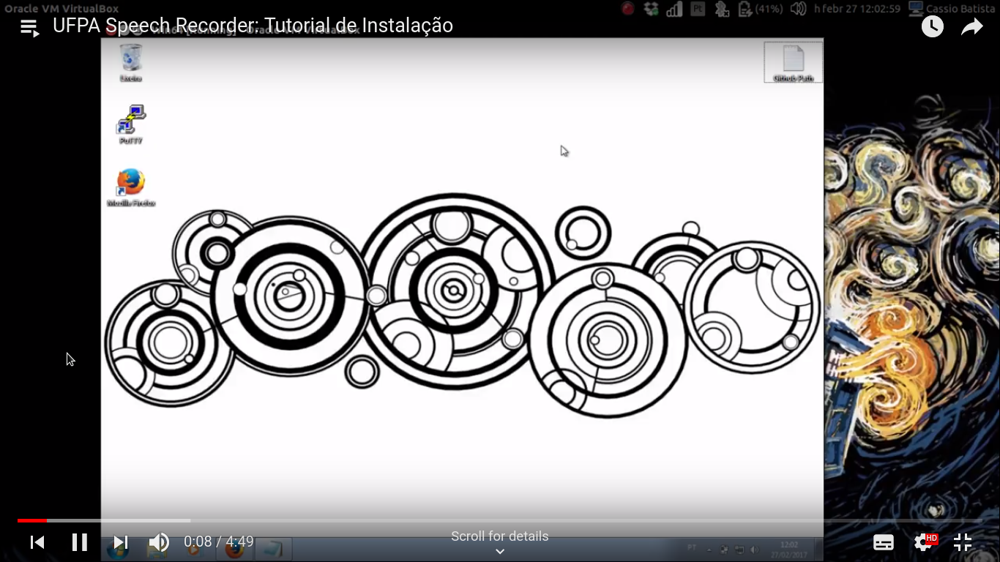

# UFPA Speech Recorder Versão 1.0, fevereiro de 2017

## Tutorial e Demonstração

[](https://www.youtube.com/playlist?list=PLi8SBlGbuJHNidvv8HoyCFdiqaQH8vhhU "Tutorial")

## Windows

#### Dependências:
1) Python 2.7:
	https://www.python.org/downloads/release/python-2713/   
	a) 32 bits --> Windows x86 MSI Installer   
	b) 64 bits --> Windows x86-64 MSI Installer   
2) PyQt4:
	https://sourceforge.net/projects/pyqt/files/PyQt4/PyQt-4.11.4/   
	a) 32 bits --> PyQt4-4.11.4-gpl-Py2.7-Qt4.8.7-x32.exe   
	b) 64 bits --> PyQt4-4.11.4-gpl-Py2.7-Qt4.8.7-x64.exe   
3) PyQtGraph (Opcional):
	http://www.pyqtgraph.org/    
	a) 32 bits --> pyqtgraph-0.10.0.win32.exe   
	b) 64 bits --> pyqtgraph-0.10.0.win-amd64.exe   

### Execução:
Dois cliques sobre o arquivo "UFPA-Speech-Recorder" 

## Linux

### Dependências:
1) Python 2.7:
```
$ sudo apt-get install python2.7
```
2) PyQt4:
```
$ sudo apt-get install python-qt4 python-qt4-dev pyqt4-dev-tools
```
3) PyAudio:
```
$ sudo apt-get install python-pyaudio # (opcional, mas recomendado)
```

### Execução:
```
$ python -B UFPA-Speech-Recorder.py
```

### Contato:
1) Cassio Trindade Batista    
	email: cassio.batista.13@gmail.com   
	Aluno de mestrado do Programa de Pós-Graduação em Ciência da Computação (UFPA)   
2) Nelson Cruz Sampaio Neto    
	email: dnelsonneto@gmail.com   
	Professor da Faculdade de Computação (UFPA)   

__Copyleft 2017__    
__Grupo FalaBrasil__    
Programa de Pós-Graduação em Ciência da Computação   
Universidade Federal do Pará   
Belém -- Pará -- Brasil    
